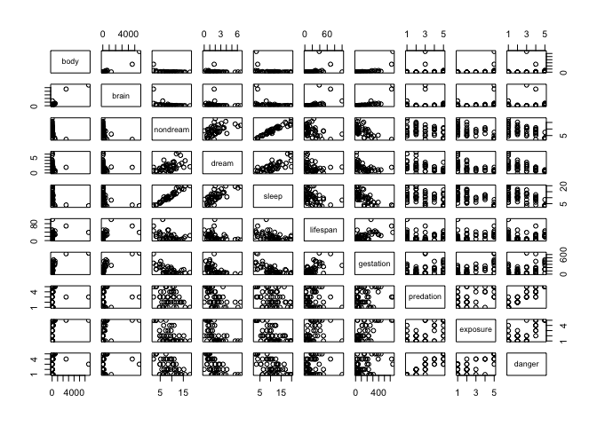
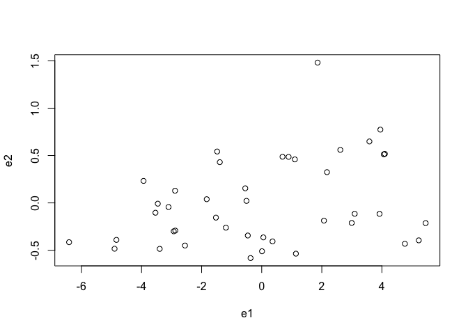
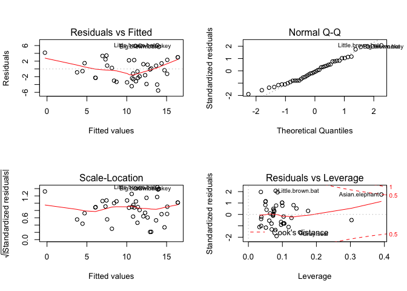

Mammal Sleep Data Analysis
--------------------------

author: Yue Jiang

This data set comes from a research paper called "Sleep in Mammals:
Ecological and Constitutional Correlates" by Allison, T. and Cicchetti,
D., published in "Science" in 1976. It is available in faraway package.
The mammalsleep data frame has 62 rows and 10 columns.  
 The following table explains the meaning and measurement units of each
variable.

<table>
<colgroup>
<col width="20%" />
<col width="79%" />
</colgroup>
<thead>
<tr class="header">
<th align="left">variable</th>
<th align="left">description</th>
</tr>
</thead>
<tbody>
<tr class="odd">
<td align="left">body</td>
<td align="left">body weight in kg</td>
</tr>
<tr class="even">
<td align="left">brain</td>
<td align="left">brain weight in g</td>
</tr>
<tr class="odd">
<td align="left">nondream</td>
<td align="left">slow wave (&quot;nondreaming&quot;) sleep (SWS) (hrs/day)</td>
</tr>
<tr class="even">
<td align="left">dream</td>
<td align="left">paradoxical (&quot;dreaming&quot;) sleep (PS) (hrs/day)</td>
</tr>
<tr class="odd">
<td align="left">sleep</td>
<td align="left">total sleep (hrs/day) (sum of slow wave and paradoxical sleep)</td>
</tr>
<tr class="even">
<td align="left">lifespan</td>
<td align="left">maximum life span (years)</td>
</tr>
<tr class="odd">
<td align="left">gestation</td>
<td align="left">gestation time (days)</td>
</tr>
<tr class="even">
<td align="left">predation</td>
<td align="left">predation index (1-5) 1 = minimum (least likely to be preyed upon) to 5 = maximum (most likely to be preyed upon)</td>
</tr>
<tr class="odd">
<td align="left">exposure</td>
<td align="left">sleep exposure index (1-5) 1 = least exposed (e.g. animal sleeps in a well-protected den) 5 = most exposed</td>
</tr>
<tr class="even">
<td align="left">danger</td>
<td align="left">overall danger index (1-5) (based on the above two indices and other information) 1 = least danger (from other animals) 5 = most danger (from other animals)</td>
</tr>
</tbody>
</table>

First of all, I’d like to look at the summary of the data.

    library(faraway)
    str(mammalsleep) 

    ## 'data.frame':    62 obs. of  10 variables:
    ##  $ body     : num  6654 1 3.38 0.92 2547 ...
    ##  $ brain    : num  5712 6.6 44.5 5.7 4603 ...
    ##  $ nondream : num  NA 6.3 NA NA 2.1 9.1 15.8 5.2 10.9 8.3 ...
    ##  $ dream    : num  NA 2 NA NA 1.8 0.7 3.9 1 3.6 1.4 ...
    ##  $ sleep    : num  3.3 8.3 12.5 16.5 3.9 9.8 19.7 6.2 14.5 9.7 ...
    ##  $ lifespan : num  38.6 4.5 14 NA 69 27 19 30.4 28 50 ...
    ##  $ gestation: num  645 42 60 25 624 180 35 392 63 230 ...
    ##  $ predation: int  3 3 1 5 3 4 1 4 1 1 ...
    ##  $ exposure : int  5 1 1 2 5 4 1 5 2 1 ...
    ##  $ danger   : int  3 3 1 3 4 4 1 4 1 1 ...

    summary(mammalsleep) 

    ##       body              brain            nondream          dream      
    ##  Min.   :   0.005   Min.   :   0.14   Min.   : 2.100   Min.   :0.000  
    ##  1st Qu.:   0.600   1st Qu.:   4.25   1st Qu.: 6.250   1st Qu.:0.900  
    ##  Median :   3.342   Median :  17.25   Median : 8.350   Median :1.800  
    ##  Mean   : 198.790   Mean   : 283.13   Mean   : 8.673   Mean   :1.972  
    ##  3rd Qu.:  48.203   3rd Qu.: 166.00   3rd Qu.:11.000   3rd Qu.:2.550  
    ##  Max.   :6654.000   Max.   :5712.00   Max.   :17.900   Max.   :6.600  
    ##                                       NA's   :14       NA's   :12     
    ##      sleep          lifespan         gestation        predation    
    ##  Min.   : 2.60   Min.   :  2.000   Min.   : 12.00   Min.   :1.000  
    ##  1st Qu.: 8.05   1st Qu.:  6.625   1st Qu.: 35.75   1st Qu.:2.000  
    ##  Median :10.45   Median : 15.100   Median : 79.00   Median :3.000  
    ##  Mean   :10.53   Mean   : 19.878   Mean   :142.35   Mean   :2.871  
    ##  3rd Qu.:13.20   3rd Qu.: 27.750   3rd Qu.:207.50   3rd Qu.:4.000  
    ##  Max.   :19.90   Max.   :100.000   Max.   :645.00   Max.   :5.000  
    ##  NA's   :4       NA's   :4         NA's   :4                       
    ##     exposure         danger     
    ##  Min.   :1.000   Min.   :1.000  
    ##  1st Qu.:1.000   1st Qu.:1.000  
    ##  Median :2.000   Median :2.000  
    ##  Mean   :2.419   Mean   :2.613  
    ##  3rd Qu.:4.000   3rd Qu.:4.000  
    ##  Max.   :5.000   Max.   :5.000  
    ## 

    head(mammalsleep)

    ##                               body  brain nondream dream sleep lifespan
    ## African.elephant          6654.000 5712.0       NA    NA   3.3     38.6
    ## African.giant.pouched.rat    1.000    6.6      6.3   2.0   8.3      4.5
    ## Arctic.Fox                   3.385   44.5       NA    NA  12.5     14.0
    ## Arctic.ground.squirrel       0.920    5.7       NA    NA  16.5       NA
    ## Asian.elephant            2547.000 4603.0      2.1   1.8   3.9     69.0
    ## Baboon                      10.550  179.5      9.1   0.7   9.8     27.0
    ##                           gestation predation exposure danger
    ## African.elephant                645         3        5      3
    ## African.giant.pouched.rat        42         3        1      3
    ## Arctic.Fox                       60         1        1      1
    ## Arctic.ground.squirrel           25         5        2      3
    ## Asian.elephant                  624         3        5      4
    ## Baboon                          180         4        4      4

    plot(mammalsleep)

We need to remove datapoints with NAs in them before further analysis.
To do so, I use na.omit function.

    complete = na.omit(mammalsleep)

The “complete” is a subset of “mammalsleep” that only contains rows with
no missing values. “complete” has 42 observations.  
 We see that sleep variable is the sum of SWS(non-dream) and PS(dream).
Since our analysis focuses on the relationship between sleep and
predation, we want to use only one of “sleep”,”dream”,”nondream” in our
model at a time to avoid collinearity. In my following regression
analysis, I decide to choose “sleep”/”dream”/ “nondream” as dependent
variables and treat “predation” as an explanatory variable.

    cor(complete)

    ##                  body       brain   nondream       dream      sleep
    ## body       1.00000000  0.95584875 -0.3936373 -0.07488845 -0.3428373
    ## brain      0.95584875  1.00000000 -0.3867947 -0.07427740 -0.3370815
    ## nondream  -0.39363729 -0.38679474  1.0000000  0.51824287  0.9676730
    ## dream     -0.07488845 -0.07427740  0.5182429  1.00000000  0.7171864
    ## sleep     -0.34283732 -0.33708151  0.9676730  0.71718643  1.0000000
    ## lifespan   0.46982146  0.62938940 -0.3722345 -0.26834006 -0.3824462
    ## gestation  0.71434413  0.73353206 -0.6061048 -0.40893177 -0.6144743
    ## predation  0.09588524 -0.01538017 -0.3526558 -0.39795310 -0.4047155
    ## exposure   0.40563880  0.32318968 -0.5802789 -0.50363338 -0.6213578
    ## danger     0.25932512  0.15093686 -0.5346247 -0.57194862 -0.6043029
    ##              lifespan   gestation   predation   exposure      danger
    ## body       0.46982146  0.71434413  0.09588524  0.4056388  0.25932512
    ## brain      0.62938940  0.73353206 -0.01538017  0.3231897  0.15093686
    ## nondream  -0.37223446 -0.60610477 -0.35265576 -0.5802789 -0.53462471
    ## dream     -0.26834006 -0.40893177 -0.39795310 -0.5036334 -0.57194862
    ## sleep     -0.38244618 -0.61447431 -0.40471545 -0.6213578 -0.60430286
    ## lifespan   1.00000000  0.64638866 -0.16973575  0.3157456  0.01468596
    ## gestation  0.64638866  1.00000000  0.09079823  0.5734727  0.30623551
    ## predation -0.16973575  0.09079823  1.00000000  0.6256876  0.92731729
    ## exposure   0.31574564  0.57347265  0.62568764  1.0000000  0.78980702
    ## danger     0.01468596  0.30623551  0.92731729  0.7898070  1.00000000

    vif(fit1)

    ##      body     brain  lifespan gestation predation  exposure    danger 
    ## 25.176774 30.126322  3.902487  3.535876 11.109379  4.854897 15.746424

First, let me check the correlation matrix of the 10 variables. Figure
shown above. “predation” is highly correlated with “danger” variable ;
and also semi-highly correlated with “exposure”. So we say these three
variables are collinear. Collinearity among explanatory variables is a
problem because it masks the importance of each variable Xi in
determining Y(dependent variable), so we don’t know how much value the
added variable truly contributes to the effect, if we perform stepwise
regression by forward selection.

On the flip side, by removing one of correlated explanatory variables,
say Xi, from the model, the variation in Y caused by Xi will be
inappropriately attributed to the remaining correlated variable Xj
(j&lt;&gt;i). Xj’s coefficient will be biased. This phenomena is called
the omitted variable bias.

So it seems it’s inappropriate to either use all or removing some
correlated variables. I have a dilemma here. Instead of manually
selecting variables, I resort to bestglm function and use BIC as
selecting criterion. I use “sleep” as dependent variable, and include
“body”, “brain”, “lifespan”, “gestation”, “predation”, ”exposure” and
“danger” as possible predictors for the bestglm function to choose from.

     ## to use bestglm to select variables
    library(bestglm)

    ## Warning: package 'bestglm' was built under R version 3.1.2

    ## Loading required package: leaps

    Xy=complete[,c("body","brain","lifespan","gestation","predation","exposure","danger","sleep")]
    bestBIC = bestglm(Xy,IC="BIC")
    bestBIC

    ## BIC
    ## BICq equivalent for q in (0.435423570021463, 0.547624397337731)
    ## Best Model:
    ##                Estimate  Std. Error   t value     Pr(>|t|)
    ## (Intercept) 16.08903731 1.172830476 13.718127 2.678962e-16
    ## gestation   -0.01236437 0.004664223 -2.650896 1.164045e-02
    ## predation    2.10950191 1.047739932  2.013383 5.119686e-02
    ## danger      -3.74194033 1.143140461 -3.273386 2.268552e-03

    summary(bestBIC)

    ## Fitting algorithm:  BIC-leaps
    ## Best Model:
    ##            df deviance
    ## Null Model 38 354.4176
    ## Full Model 41 909.3229
    ## 
    ##  likelihood-ratio test - GLM
    ## 
    ## data:  H0: Null Model vs. H1: Best Fit BIC-leaps
    ## X = 554.9053, df = 3, p-value < 2.2e-16

As seen from above, the function automatically picked gestation,
predation and danger as predictors.

The fitted model is \#\#\#\#\# sleep = -0.0123 gestation + 2.1095
predation - 3.742 danger + 16.089

Gestation and danger are negatively associated with sleep, while
predation is positively associated. Note that the earlier correlation
matrix shows -0.405 correlation between predation and sleep, but here
the model shows they are positively correlated. This seeming anomaly is
because correlation measures relationships only between pairs of
variables, but the regression fit can account for several variables
simultaneously. To illustrate it more visually, I am making an added
variable plot.

First I fit a regression model of sleep on gestation and danger,
excluding predation. I get its residuals1. Then I fit a regression model
of predation on gestation and danger, excluding sleep, and I get its
residuals e2 By plotting the two residuals, I can see the relationship
between sleep and predation, with other variables controlled.

    ## added value plot
    # regression without predation
    sleep_dang_gest = lm(sleep~ gestation + danger, data = complete)
    e1 = resid(sleep_dang_gest)

    # regression without sleep
    predate_dang_gest = lm(predation ~ gestation + danger, data = complete)
    e2 = resid(predate_dang_gest)

    plot(e1,e2)

From the plot, we can clearly see a generally positive relationship. Now
that we have a model, I want to check the validity of our model
assumptions.

    best = lm(sleep~ gestation + predation + danger, data= complete)
    par(mfrow = c(2,2))
    plot(best)

This result is less than satisfactory. The residual v.s. fitted plot has
data crowed on the right hand side and show a v shaped pattern. This
plot along with scale location plot and QQ plot identify “little brown
bat”, “big brown bat”, “owl monkey” as outliers. Cooks’ distance plot
identifies “Asian elephant” as a high leverage point. The QQ plot is not
linear, especially in the lower quantile portion.

Let me remove “little brown bat”, “big brown bat”, “owl monkey” and
“Asian elephant” to see what the fit looks like. I perform the following
code.

    short_complete = complete[-c(5,7,33,42),]
    short_best = lm(sleep~ gestation + predation + danger, data = short_complete)
    summary(short_best)

    ## 
    ## Call:
    ## lm(formula = sleep ~ gestation + predation + danger, data = short_complete)
    ## 
    ## Residuals:
    ##     Min      1Q  Median      3Q     Max 
    ## -5.9381 -2.2230 -0.0802  2.3374  5.6990 
    ## 
    ## Coefficients:
    ##             Estimate Std. Error t value Pr(>|t|)    
    ## (Intercept) 16.62266    1.28376  12.948 1.06e-14 ***
    ## gestation   -0.01344    0.00505  -2.661  0.01180 *  
    ## predation    1.66695    1.08947   1.530  0.13525    
    ## danger      -3.38709    1.19396  -2.837  0.00762 ** 
    ## ---
    ## Signif. codes:  0 '***' 0.001 '**' 0.01 '*' 0.05 '.' 0.1 ' ' 1
    ## 
    ## Residual standard error: 3.073 on 34 degrees of freedom
    ## Multiple R-squared:  0.6042, Adjusted R-squared:  0.5693 
    ## F-statistic:  17.3 on 3 and 34 DF,  p-value: 5.405e-07

The absolute value of t value became smaller for most explanatory
variables after removing the outliers and high leverage points. The R
squared is also smaller. Both facts suggest that this truncated model is
not as good as the earlier one containing all data points.

### Further discussion

The bestglm function with BIC selecting criteria selects “gestation”,
“predation” and “danger” to explain “sleep”. All three variables are
statistically significant, as shown in Figure 4. Although “sleep” and
“predation” have negative correlation coefficient as seen from the
correlation matrix. The regression model indicates a positive relation
between them. That is, even though we observe higher chance to be preyed
upon is associated less hours of sleep among the species, this negative
relation is caused by other factors influencing “sleep” simultaneously.
Our model takes this into account and suggests the negative relation
comes from “danger” and “gestation”. When we keep “danger” and
“gestation” constant, “predation” exhibits positive relation with
“sleep”, demonstrated by the added value plot. This result suggests that
the more danger a species faces, the less sleep it gets. It’s easy to
understand because the species in danger tends to sacrifice sleep time
to watch out the surroundings. The longer gestation time, the less sleep
can also be explained by the “danger” variable. During gestation,
females are more vulnerable, exposed to more danger than their normal
condition. So they tend to sleep less to keep safe. With the same level
of danger and gestation time, higher chance to be preyed upon can be a
result of more sleep time. But this causal relation is beyond the scope
of this analysis.
